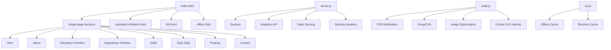

# Website Improvement Plan — Nicolas Roguski Portfolio

> **Date:** May 29, 2026
> **Audit Scope:** Full-stack personal portfolio website (Express + vanilla JS/CSS)
> **Current State:** Single-page app with one sub-page (myostatin-inhibitors.html), custom analytics, service worker, and build pipeline

---

## Table of Contents

1. [Executive Summary](#executive-summary)
2. [Current Architecture Overview](#current-architecture-overview)
3. [Category 1: Website Restructuring Ideas](#category-1-website-restructuring-ideas)
4. [Category 2: Visual Enhancements](#category-2-visual-enhancements)
5. [Category 3: Technical Improvements](#category-3-technical-improvements)
6. [Priority Matrix](#priority-matrix)

---

## Executive Summary

The site is a well-crafted single-page portfolio for a Biomedical Physiology student at SFU. It features a sophisticated design system (sage/gold/cream palette), GSAP-powered animations, a custom loader, dark mode, a service worker for offline support, privacy-first analytics, and a build pipeline with CSS minification, PurgeCSS, and image optimization. The codebase is clean and well-organized.

However, there are opportunities to expand the site's depth, improve accessibility, enhance performance further, and better position Nicolas for research/internship opportunities.

---

## Current Architecture Overview



---

## Category 1: Website Restructuring Ideas

### 1.1 Convert to a Multi-Page Architecture

**Current:** All content lives in a single `index.html` with anchor-based navigation.
**Recommendation:** Split into logical pages for better SEO, faster initial loads, and clearer content hierarchy.

| Proposed Page | URL | Content | Priority |
|---|---|---|---|
| Home | `/` | Hero, About, Stats strip | High |
| Research | `/research` | Projects, papers, academic interests | High |
| Experience | `/experience` | Education timeline, work experience | Medium |
| Skills | `/skills` | Skills grid, topic strip | Medium |
| Contact | `/contact` | Contact form, info, CV download | Low |

**Justification:**
- Each page would load only its own critical CSS/JS, reducing initial bundle size
- Search engines can index each page independently with targeted meta tags
- Enables per-page analytics tracking
- Reduces the complexity of the horizontal scroll project section (which currently requires GSAP pinning)

### 1.2 Add a Blog / Research Notes Section

**Current:** Only one research paper (myostatin inhibitors) is featured.
**Recommendation:** Create a `/research` or `/writing` section with individual pages for each paper or research note.

**Justification:**
- Demonstrates ongoing intellectual engagement to potential research supervisors
- Provides fresh content for SEO (Google rewards regularly updated sites)
- Creates a natural content pipeline as Nicolas progresses through his degree
- The existing `myostatin-inhibitors.html` can serve as a template for future papers

### 1.3 Create a Dedicated CV / Resume Page

**Current:** CV is only available as a PDF download via modal.
**Recommendation:** Build a dedicated `/cv` page that renders the CV as structured HTML with print-to-PDF capability.

**Justification:**
- HTML CV is indexable by search engines and LinkedIn crawlers
- More accessible than a PDF (screen readers, mobile)
- Can include schema.org markup for structured data
- PDF download remains as an alternative

### 1.4 Restructure Navigation for Scalability

**Current:** Nav has 4 items (About, Skills, Works, Contact) with hover previews.
**Recommendation:** Implement a tiered navigation that can accommodate future pages:

```
N. Roguski  [About]  [Research]  [Experience]  [Writing]  [Contact]
                    ├── Myostatin Inhibitors
                    ├── Exercise Physiology
                    └── Neuropharmacology
```

**Justification:**
- The current nav previews are visually appealing but don't scale well
- A dropdown or mega-menu pattern would accommodate 2-3x more items
- Keeps the site extensible without redesigning navigation each time

### 1.5 Add a Projects Archive Page

**Current:** Projects are horizontally scrollable cards on the homepage.
**Recommendation:** Create a `/projects` archive page with a grid layout, filtering, and search.

**Justification:**
- The horizontal scroll is visually impressive but limits how many projects can be shown
- An archive page with filters (by status: Published / In Progress / Planned) would be more functional
- The homepage can feature the top 3 projects; the archive holds the rest

---

## Category 2: Visual Enhancements

### 2.1 Add Micro-Interactions and Hover States

**Current:** Basic hover states exist on buttons, cards, and nav items.
**Recommendation:** Add subtle micro-interactions throughout:

| Element | Interaction | Justification |
|---|---|---|
| Skill cards | Scale + border glow on hover | Currently only background color changes; feels flat |
| Timeline items | Expand description on hover | Currently static; could reveal more detail |
| Contact form inputs | Animated label float | Currently placeholder-only; floating labels are more accessible and polished |
| Social links | Icon wiggle or underline draw | Adds personality to otherwise static links |
| Back-to-top button | Rotate or pulse on scroll threshold | Currently just fades in; could be more engaging |

### 2.2 Enhance the Dark Mode Experience

**Current:** Dark mode swaps CSS custom properties but feels like an afterthought.
**Recommendation:**
- Add a smooth transition animation when toggling (`transition: background-color 0.4s, color 0.4s, border-color 0.4s` on `html`)
- Redesign the dark mode toggle to be more visually prominent (pill-shaped toggle with sun/moon icon)
- Add dark-mode-specific imagery (e.g., a darker variant of the hero photo treatment)
- Ensure the topic strip marquee text is more readable in dark mode (currently `rgba(245,240,232,0.28)` is very faint)

**Justification:**
- Dark mode users are often power users who appreciate attention to detail
- Smooth transitions make the toggle feel native rather than jarring
- Better dark mode = longer engagement from users who prefer it

### 2.3 Improve Typography Hierarchy

**Current:** Three typefaces (Cormorant Garamond, Jost, DM Mono) are used well but could be refined.
**Recommendation:**
- Increase `font-weight` on body text from 300 to 350 or 400 for better readability on high-DPI screens
- Add more size contrast between section titles (`clamp(2.2rem, 4vw, 3.2rem)`) and body copy
- Use DM Mono more sparingly — currently used for labels, tags, stats, and hints, which dilutes its impact
- Consider adding `font-optical-sizing` for variable fonts to improve rendering across sizes

**Justification:**
- The 300 weight on Jost can appear thin on some screens
- DM Mono loses its 